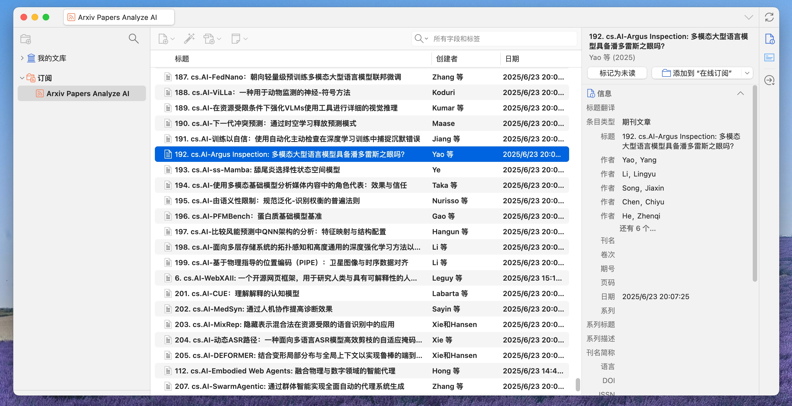
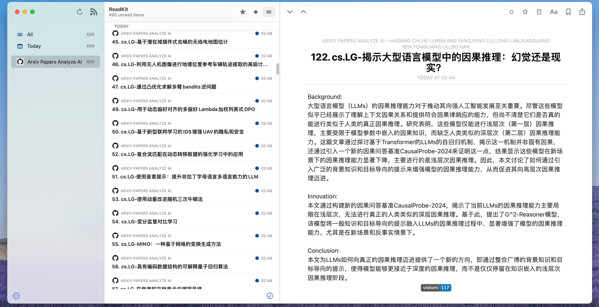

    

 

# Introduction

**600+ papers** analyzed by **LLM** every day!

The latest arXiv papers will be crawled and analyzed by topic (e.g., `cs.AI`, `cs.CL`, `cs.CV`, `cs.LG`, `cs.SE`, etc.), and LLM will be used to extract `background`, `innovation`, and `conclusion`. The results will be exported daily as `markdown` files and `rss/atom` files.

You can also fork this repo to run the code on your local machine or Github actions workflow to analyze the latest arXiv papers automatically.

# arXiv Papers

The following fields will be exported to markdown file and rss/atom file:

<table>
    <thead>
        <tr>
            <th>topic</th>
            <th>title</th>
            <th>authors</th>
            <th>background</th>
            <th>innovation</th>
            <th>conclusion</th>
        </tr>
    </thead>
</table>

## ATOM/RSS
You can subscribe to the fllowing atom/rss source to get the latest papers analyzed by AI on daily:

**Click the badge to subscribe👇**

  

 

[Zotero](https://www.zotero.org/) is a cross-platform(Mac, Windows, Linux, iOS, and Android) reference management tool that can be used to manage your references. You can also use it to import the arxiv papers from atom/rss.

[Readkit](https://readkit.app/) is a cross-platform app(Mac, iOS, iPad) that can sync subscriptions, articles and read statuses between platforms if you use one of the supported feed aggregators or read-later services.

  
  

## Markdown
The latest arxiv papers in subfields `cs.AI`, `cs.CL`, `cs.CV`, `cs.LG`, `cs.SE` will be analyzed by AI on daily and markdown files will be exported as below. 

**Click the badge to read👇**

                                                                                                                                                                                                                                                                                                                                                        

# Top arXiv CS Subfields
According to the recent submission dynamics and field activity of the computer science (cs) category on the arXiv platform, combined with the number of papers, research trends and interdisciplinary influence, the following is the most popular sub-direction classification and specific research hotspot analysis:

| subfield id | field name | top activity description | core research directions (recent high-frequency topics) |
| --- | --- | --- | --- |
| `CS.AI` | Artificial Intelligence | ☆☆☆☆☆The number of submissions ranks first, accounting for more than 30% of the total CS submissions. | Generative AI applications, multi-agent collaboration, explainability, alignment algorithms |
| `CS.CL` | Computation and Language | ☆☆☆☆Natural language processing has exploded in growth, with the top 3 daily updates. | Large Language Model (LLM) optimization, RAG enhancement, multilingual evaluation, harmful content detection. |
| `CS.CV` | Computer Vision | ☆☆☆☆Multimodal technologies drive growth, with demand for industrial applications surging. | 3D generation (AR fusion), video understanding, weakly supervised positioning, medical image analysis. | 
| `CS.LG` | Learning and Optimization | ☆☆☆☆High level of basic theory + applied research, closely intertwined with AI/CV. | Dynamic data pruning, efficient training, graph neural networks, federated learning. |
| `CS.SE` | Software Engineering | ☆☆☆Generative AI drives innovation, and emerging tool chains attract attention. | AI-assisted programming, multi-agent systems, protocol fuzz testing, code generation. |

<picture>
  <source
    media="(prefers-color-scheme: dark)"
    srcset="
      https://api.star-history.com/svg?repos=nituchao/latest_arxiv_analyze_ai&type=Date&theme=dark
    "
  />
  <source
    media="(prefers-color-scheme: light)"
    srcset="
      https://api.star-history.com/svg?repos=nituchao/latest_arxiv_analyze_ai&type=Date
    "
  />
  
</picture>
